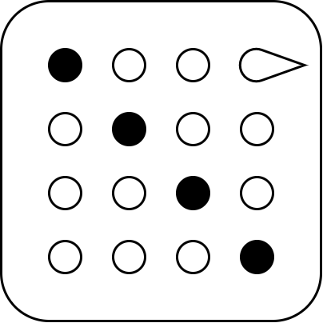



# Disfigure

## Postures Licence
	
	
You can use Disfigure to generate still or animated postures of 3D models. You are allowed:

* to freely use these images, videos and animations;
* to modify, adapt and build on them in any imaginable way;
* to release your work under any licence of your choice.

However, we hope that:
	
* you will not use Disfigure to disfigure any real person or idea;
* you understand that anyone could recreate the exact same postures;
* you find this software useful.

## Software Licence
	
The software is licenced under
[MIT licence](https://github.com/boytchev/disfigure?tab=MIT-1-ov-file#readme).

	<a href="../">Home</a>

